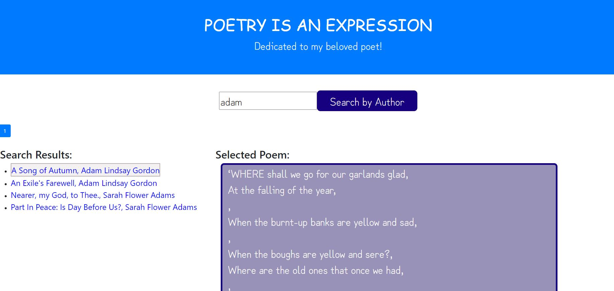

# FetchPoems
# Name: Fetch Poems

## Description: 
FetchPoems is a react program which is using react hooks, fetch functionality, pagination, and api call. The improvements made to the base version are -
1. UI changes include bootstrap, CSS Styling - button, fonts, spacing
2. Added message when no search results are returned
3. The API handling is modified to suit the chosen website

## Installation: 
1. Download the project to your desktop. If zipped, unzip it. 
2. Run 'http-server -c-1' on the command promopt (If you do not have http setup, use npm i http-server to install it.)
2. Open standalone.html file in a browser by navigating to the location using the URL http://localhost:8080/ to track your todo list. 

## Usage: 
Use this project to play with React features like react hooksm, pagination, fragments, etc.

## Support: 
There are many support portals available for React & JavaScript like MDN, StackOverflow, etc. You can use this forum to research various styles and ask questions.

## Roadmap: 
The future of this project is to add search by title & keywords

## License information: 

See MIT license release in repository.